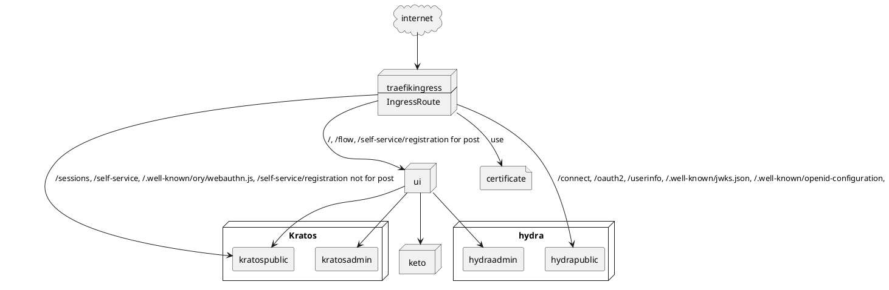
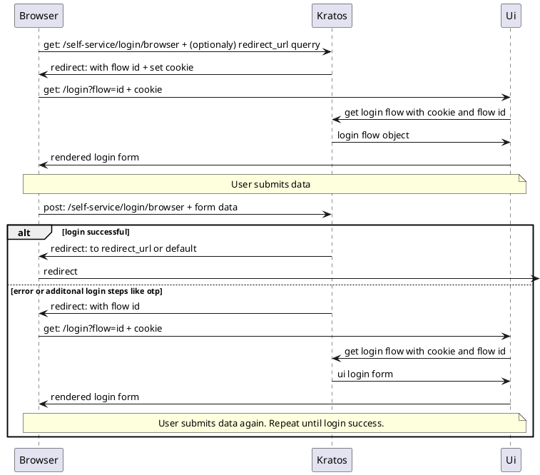
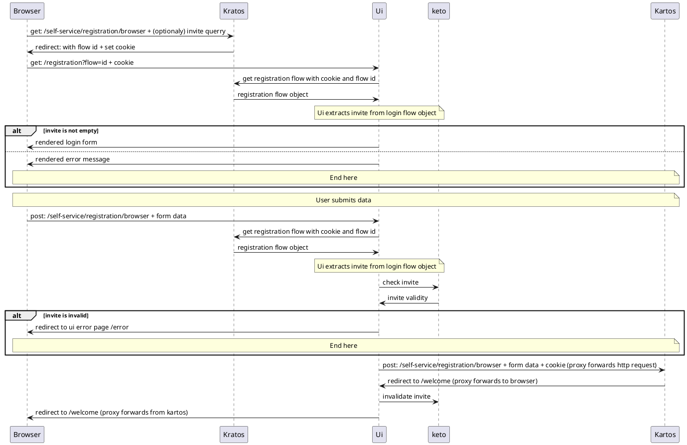
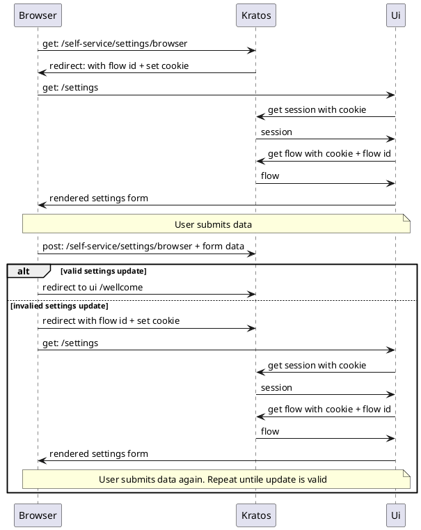

## guides
### install
`helm upgrade --install --create namespace --namespace <namespace> <release> --set config.hostname=<hostname> oci://docker.io/byteplow/idd4 --version <version>`

install from repo: `helm upgrade --install <release> --set config.hostname=<hostname> --set ui.image.tag=latest ./contrib/deployment/chart/`

### add openid connect client
`kubectl exec -it deployments/<release>-hydra -- hydra clients create --endpoint http://localhost:4445 --grant-types authorization_code,refresh_token --response-types code,id_token --scope openid --scope profile --scope email --scope offline --callbacks <https redirect url>`
### register first user
Open `https://<hostname>/self-service/registration/browser?invite=<master invite>` and register.
The master invite is hardcodes as wellknown, but that is subject to change. It will be `configurable` in your values.yaml. 
Or it will be able to be read from a secret. `kubectl get secret <release>-ui -o "jsonpath={.data['masterInvite']}" | base64 --decode`

### backup
The pvc for hydra, kratos and keto must be backed up. And also the secrets for all three. All secret values can also be set in .Values.config. Then only the values.yaml need to be backed up.

The masterInvite key may be backed up. E.g. If some other application is using it.

## diagrams
### deployment

### login flow

### registration flow

### settings flow
